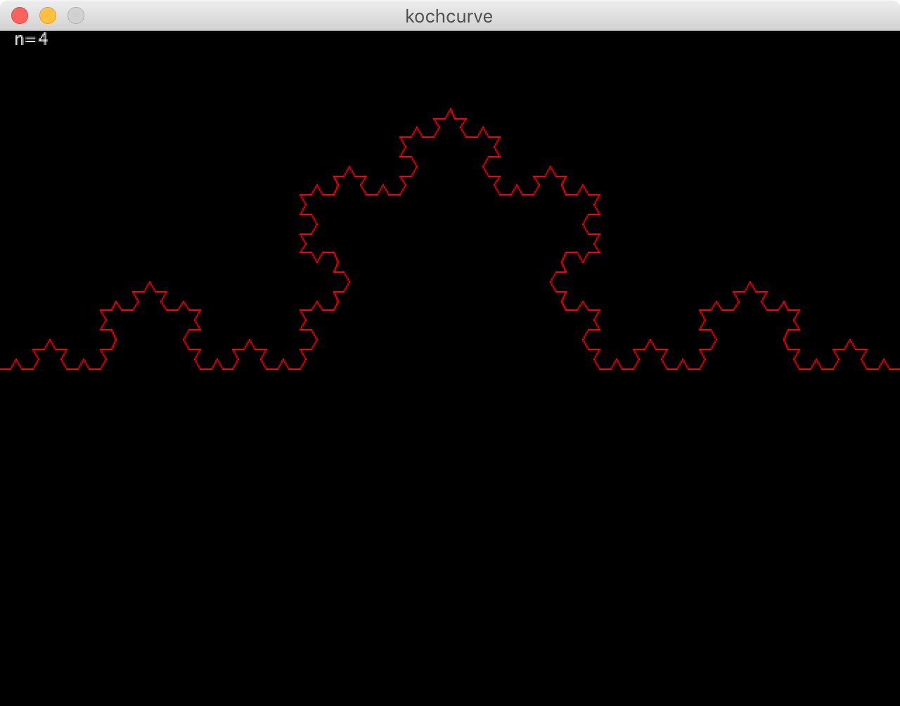
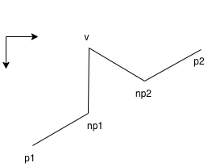

# Koch curve

Koch curve, which appeared in a 1904 by Helge von Koch is one of the fractals.

It is shown in this figure.



# Using
The source code is written in [Processing](https://processing.org).

Therefore, you open by Processing3 and run.

# Algorithm

Atomically divide Koch curve. The atomic triangle is shown in this figure.



## Step1. Divide
Divide the line(p1, p2) into three equal lines.
This defines two new points(np1, np2).
These are points that structure a new triangle.

```
Point np1 = new Point(0, 0);
Point np2 = new Point(0, 0);
Point v = new Point(0, 0);

np1.x = (2*p1.x + p2.x) / 3.0;
np1.y = (2*p1.y + p2.y) / 3.0;
np2.x = (p1.x + 2*p2.x) / 3.0;
np2.y = (p1.y + 2*p2.y) / 3.0;
```

## Step2. Structure new triangle.
Already, np1 and np2 are known as points of a new triangle. Find the last point(v).

First, Seek a midpoint of a line np1-np2.
Second, Add the resolved height(`high*cos(angle), high*sin(angle)`) x and y. "height" is reserved word.
But, y-coordinates on computer is the inverse of mathematical y-coordinates. Therefore, y direction must be
subtracted from the midpoint.

These values is point v.

```
float angle, high;

angle = PI/2 - atan2(p2.y - p1.y, p2.x - p1.x);
high = np1.dst(np2) * (sqrt(3) / 2); //sin(PI / 3.0);

v.x = (np1.x + np2.x) / 2.0 + high * cos(angle);
v.y = (np1.y + np2.y) / 2.0 - high * sin(angle);
```

## Step3. Repeat Step1 and Step2
Already, p1, np1, v, np2, p1 are seeked.
draw lines p1-np1, np1-v, v-np2 and np2-pi.
Repeat this recursively.

```
koch(n-1, p1, np1);
koch(n-1, np1, v);
koch(n-1, v, np2);
koch(n-1, np2, p2);
```
